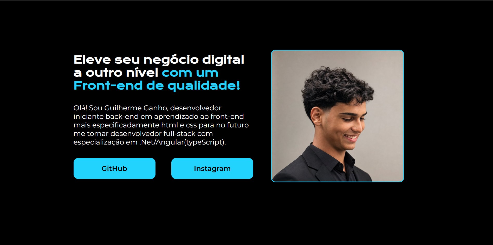

# 🚀 Portfólio - Página Inicial

Este projeto faz parte da minha jornada de aprendizado em **Front-End**.

O objetivo foi praticar os conceitos fundamentais de **HTML** e **CSS**, desenvolvendo uma página de apresentação pessoal responsiva e com um layout moderno.

## 📸 Preview do Projeto



---

## 🛠️ Tecnologias Utilizadas

- HTML5
- CSS3
- Google Fonts

---

## 📚 O que pratiquei

- Estrutura semântica com HTML
- Organização do código utilizando a metodologia BEM
- Flexbox para posicionamento dos elementos
- Estilização com CSS
- Tipografia utilizando Google Fonts
- Botões personalizados
- Organização do layout
- Espaçamentos, bordas e alinhamentos

---

## 🎯 Objetivo

Este projeto faz parte dos meus estudos em Front-End.

Estou construindo uma base sólida em **HTML, CSS e JavaScript** para, posteriormente, aplicar esses conhecimentos no desenvolvimento com **TypeScript**, **Angular** e **.NET**, seguindo minha jornada rumo ao desenvolvimento **Full Stack**.

---

## 📁 Estrutura do Projeto

```text
📦 ProjetoFront-endFigma
├── assets/
│   └── imagem do projeto
├── index.html
├── style.css
├── README.md
└── .gitignore
```
---

## 👨‍💻 Autor

Desenvolvido por **Guilherme Ganho**.

---

Projeto desenvolvido durante meus estudos de Front-End.